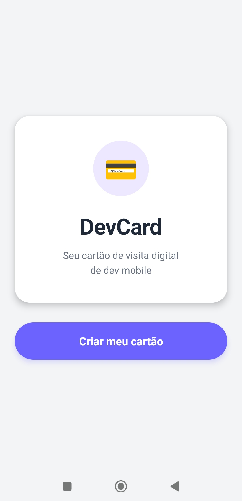
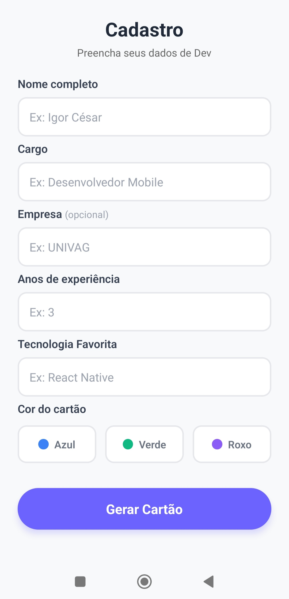

# 2º Instrumento Avaliativo - Aplicação Móveis
- Professor Brendo Vale
- Aluno: Igor César Pinheiro da Silva

---

## App DevCard

App criado como uma IA (Instrumento Avaliativo), do 2º bimestre, da matéria de Aplicações Móveis, com o professor Brendo Vale.
O **DevCard** é um cartão de visita digital para desenvolvedores mobile.

### Funcionalidades

- Tela de boas-vindas com apresentação do app
- Formulário de cadastro com validação completa
- Preview do cartão com cor personalizada e badge de nível
- Tela de sucesso com confirmação

### Tecnologias utilizadas

- React Native
- Expo
- Expo Router
- TypeScript
- Flexbox

## Capturas de tela

### 1. Boas-vindas

### 2. Cadastro

### 3. Preview do Cartão

### 4. Sucesso
